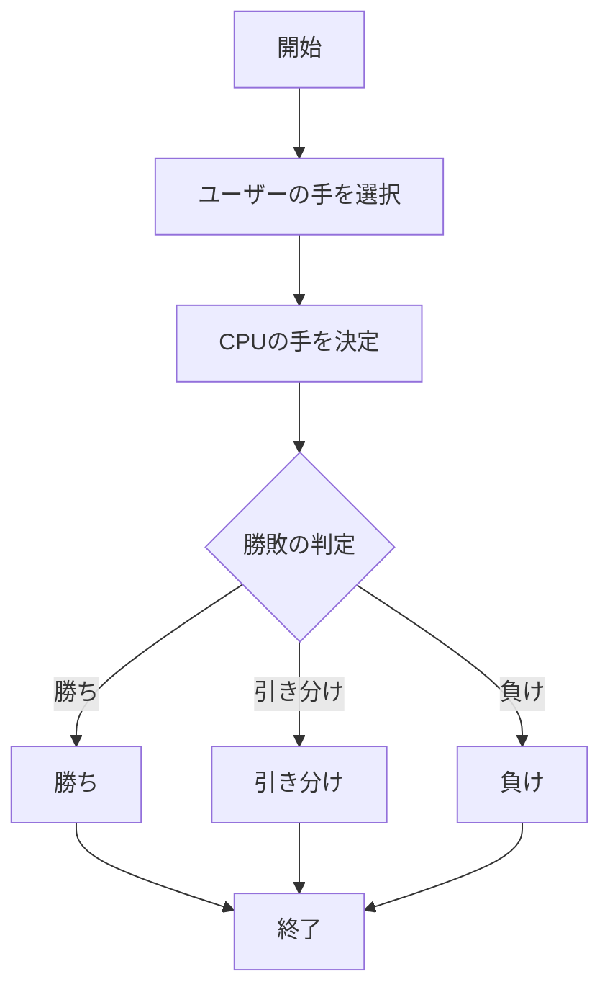
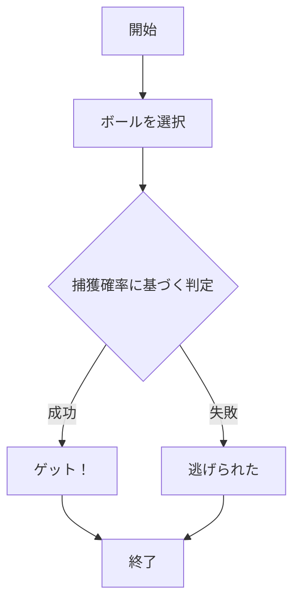

# webpro_06
2024/11/5
## このプログラムについて
## ファイル一覧
ファイル名 | 説明
-|-
app5.js | プログラム本体
public/janken.html | じゃんけんの開始画面
public/pokemon.html | ぽけもんげっと用の開始画面
views/janken.ejs |じゃんけん用ejs
views/pokemon.ejs |ぽけもんげっと用ejs
views/luck.ejs |おみくじ用ejs


## 実行方法　じゃんけん
1. app5.js を起動する
1. Webブラウザでlocalhost:8080/public/janken.htmlにアクセスする
1. 自分の手を入力する





## 実行方法　ぽけもん
1. app5.js を起動する
1. Webブラウザでlocalhost:8080/public/pokemon.htmlにアクセスする
1. ラジオボタンでボールの種類を選択する
1. ボールの種類に応じた捕獲確率を設定し、ランダムに「ゲット」か「逃げられた」を判定する
1. 結果を表示し、再挑戦できる



## 実行方法　おみくじ
1. app5.js を起動する
1. Webブラウザでlocalhost:8080/public/janken.htmlにアクセスする
1. ユーザーがアクセスするたびに1から6の運勢のいずれかがランダムに表示される

```mermaid
flowchart TD;
  start["開始"];
  random["ランダムな数を生成"];
  result{"運勢を決定"};
  
  daikichi["大吉"];
  chuukichi["中吉"];
  shoukichi["小吉"];
  suekichi["末吉"];
  kyou["凶"];
  end2["終了"];

  start --> random --> result;
  result -->|1| daikichi --> end2;
  result -->|2| chuukichi --> end2;
  result -->|3| shoukichi --> end2;
  result -->|4| suekichi --> end2;
  result -->|5| kyou --> end2;
